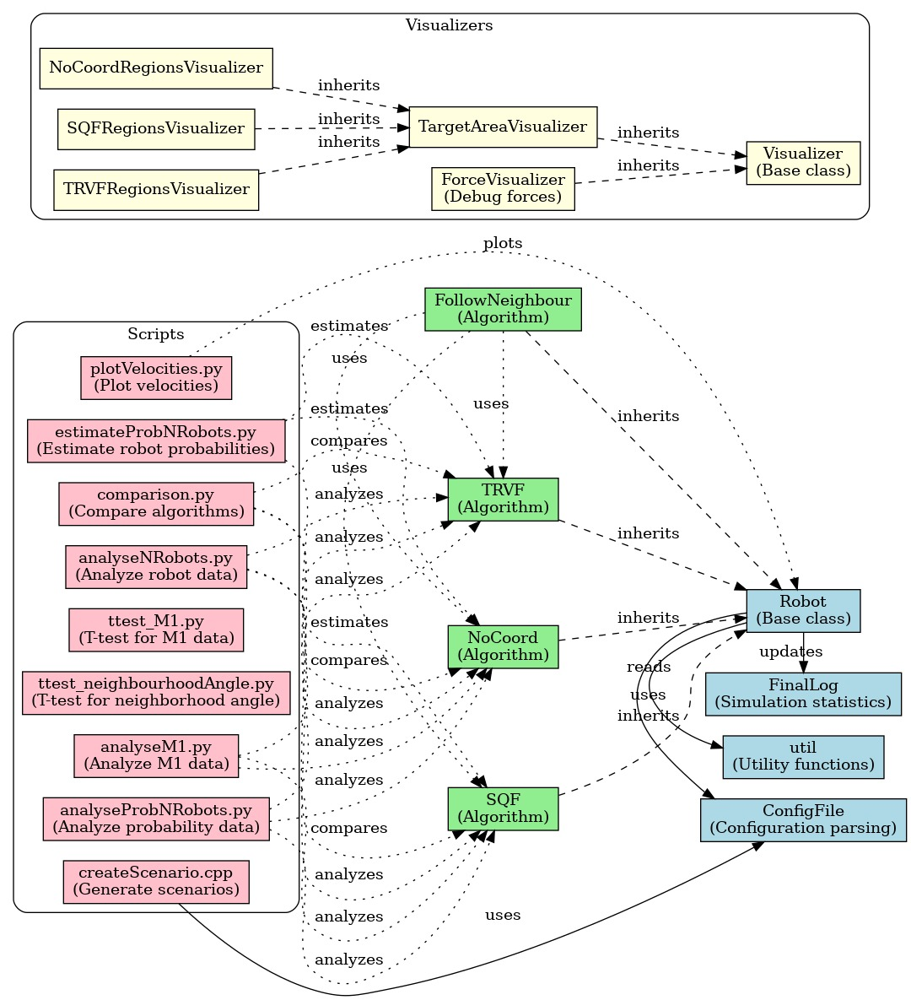

# swarm-ad-hoc-follower

An algorithm for congestion control of robotic swarms in common target area problem when the robots do not know the algorithm executed by the others. 

More details in this [thesis](https://www.research.lancs.ac.uk/portal/services/downloadRegister/401931354/2023passosphd.pdf).

# Relationship between the files



## Notes

The Ad Hoc Follower (AHF) is set by giving neighbourhoodAngle in config.ini different of zero. 

The Ad Hoc Mixed Teams (AHMT) -- or Mixed Teams (MT) -- are set by neighbourhoodAngle = 0 in config.ini.

## Dependency
Stage 
https://github.com/rtv/Stage

## Compiling
```sh
make
```

## Running an example
See test.sh.

## Running an example of experiments in batch

The file below exemplifies a configuration for performing 40 tests varying the number of robots not knowing the algorithm executed by the others (_m_) varying from 20 to 120 in steps of 20. Assume this file is named _config_m_.

~~~bash
nTests=40
varsExp=( m )
minExp=( 20 )     
maxExp=( 120 )  
increment=( 20 )
folderConf="nonholo/NoCoordAlt/SQF/robots_200/"
defaultVarNames=(s v K n m d D holo algorithm neighbourhoodAngle alternativeAlgorithm)
defaultValues=(  3 1 5 180 50 3 13 0 SQF 0 NoCoord)
~~~

To run the above experiment:

~~~bash
bash experiment.sh config_m
~~~

To run several experiments in parallel, you can shuffle the order of the variables and execute several instances of experiment.sh. For example, the file scripts/NoCoordAltSQF.sh performs all tests with the aware robots using SQF and the other group of robots (i.e., not knowing that the aware robots are using the SQF) using NoCoord as the alternative algorithm. That file executes experiments in a random order  for all possible type of robots (nonholo and holo), varying from 20 to 300 robots in steps of 20 and from 10% to 90% in steps of 10% of the robots running the alternative algorithm. To run that experiment in 10 parallel executions, use:

~~~bash
for i in `seq 1 10`; do 
  bash scripts/NoCoordAltSQF.sh &
done
~~~

See experiment.sh and the files in the folder scripts for more details.


